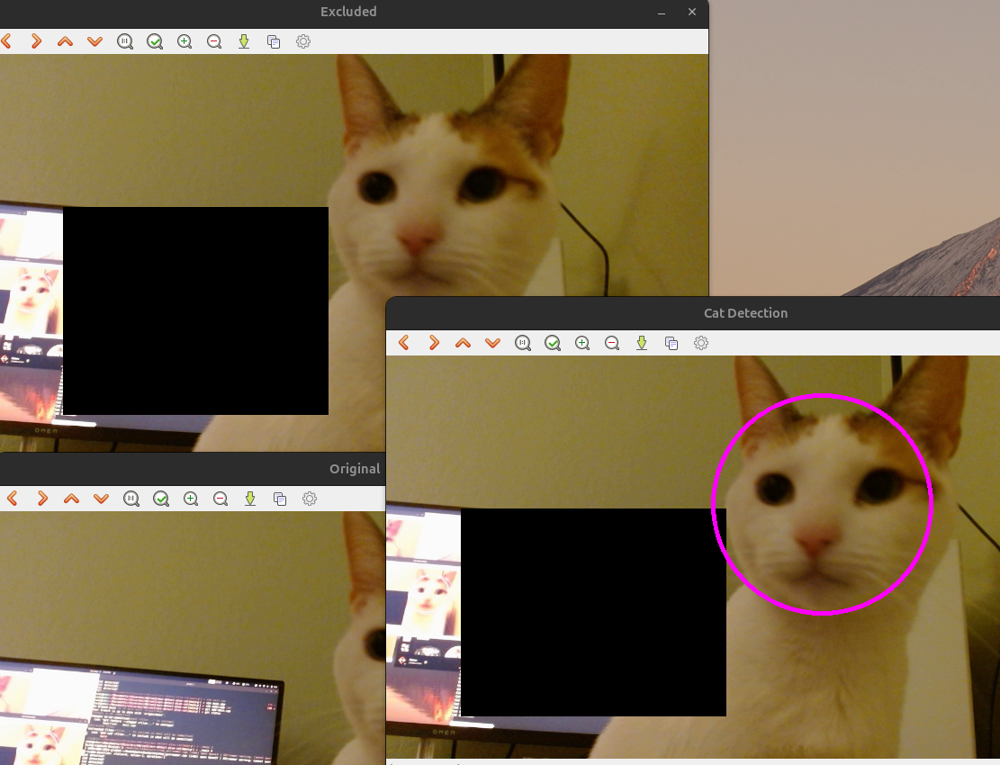

# Applied Computer Vision Project, motion detection, built in cat/pet filtering 



## Requirements
- OpenCV library must be installed (we are using 4.11.1)

## Usage
Build using the included Makefile, then run:
```
./main <capture device>
```
